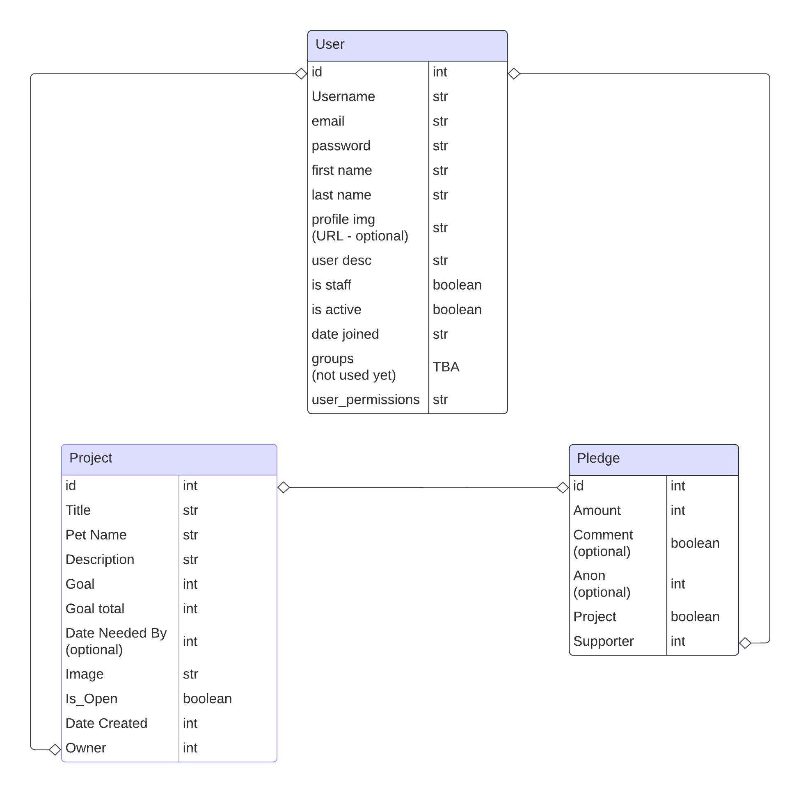

# Crowdfunding Back End
{{ Shannon Oliver }}

## Planning:
### Concept/Name
{{ Circle of Suppawt: A website to help those struggling to fund pet related medical bills }}

### Intended Audience/User Stories
{{ Anyone that owns pets that need a hand from the community to contribute a donation towards the payment of vet costs; or for people who are simply just animal lovers in general that want to help out those in need. }}

### Test Results

#### [ X ] A link to the deployed project.
https://crowdfunding-back-end-000.fly.dev/projects/
#### [ X ] A screenshot of Insomnia, demonstrating a successful GET method for any endpoint.

#### [ X ] A screenshot of Insomnia, demonstrating a successful POST method for any endpoint.

#### [ X ] A screenshot of Insomnia, demonstrating a token being returned.

### User Guide
#### [ X ] Step by step instructions for how to register a new user and create a new project (i.e. endpoints and body data)
- Make a POST request using the path: https://crowdfunding-back-end-000.fly.dev/users/
- The JSON template for a new user is:
- {
- "username": "example_username",
- "email": "example@example.com",
- "password": "example123"
- }

- You then need to get a token for your new account before making a project by making another POST request; this time the path is: https://crowdfunding-back-end-000.fly.dev/api-token-auth/
- The JSON template for getting a token with your new account is:
- {
- "username": "example_username",
- "password": "example123"
- }
- Save the token in the results for this new account.

- Make a POST request using the path: https://crowdfunding-back-end-000.fly.dev/projects/
- The JSON template for a new user is:
- {
- "title": "Example Project",
- "description": "This in an example project.",
- "goal": 100,
- "image": "https://via.placeholder.com/300.jpg",
- "is_open": true,
- "date_created": "" (use CTRL + Space to select timestamp)
- }

- You now have a new project in the database!

#### [ X ] Your refined API specification and Database Schema.

### Front End Pages/Functionality - TBA
- {{ A page on the front end }}
- {{ Dot-points showing functionality is available on this page }}
- {{ A second page available on the front end }}
- {{ Another list of dot-points showing functionality }}

##### -----Test User Credentials-----

##### super user details:
##### username - admin
##### email - admin@admin.com
##### password - admin

##### ----------

##### normal user details:
##### username - testacc1
##### email - testacc1@test.com
##### password - testacc1